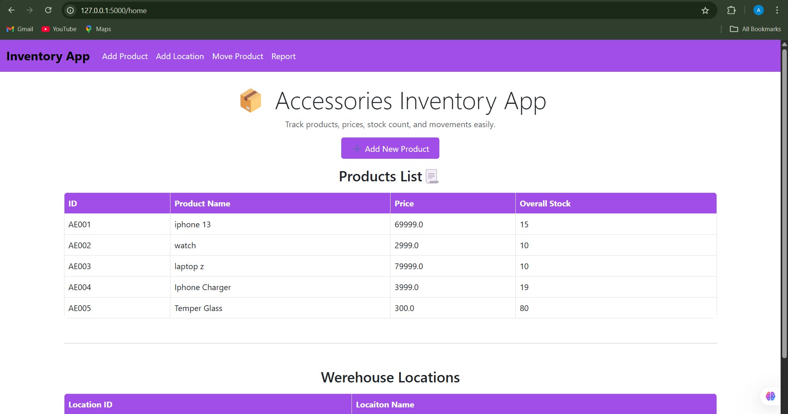
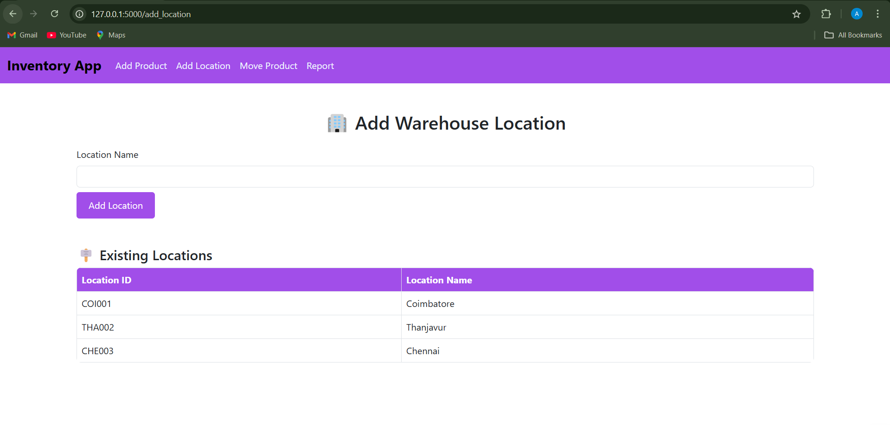
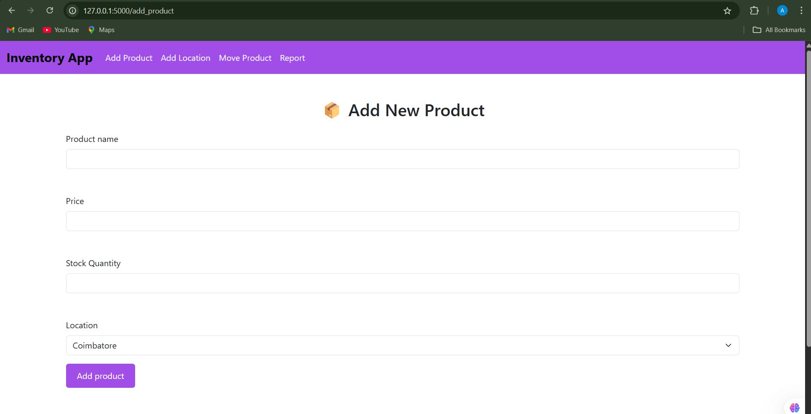
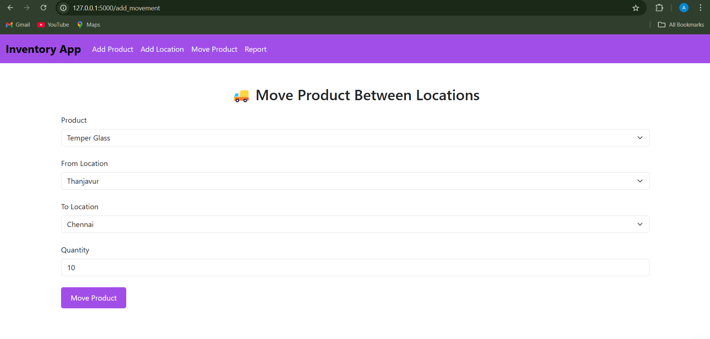
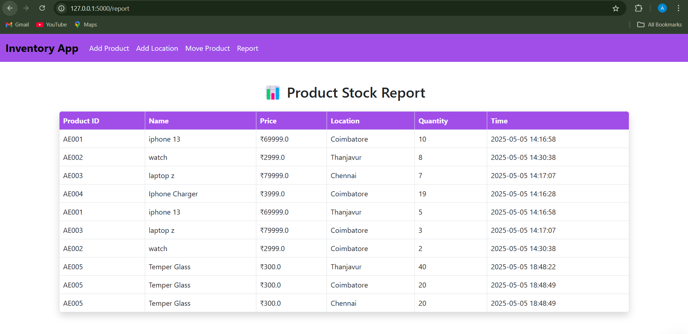
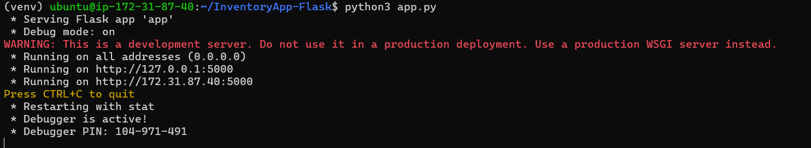

An Inventory Management System using Flask

📦 Inventory Management System
This is a basic Inventory Management System built using Flask, SQLite, and Bootstrap. It lets you:

1.Add werehouse location

2.Add products to specific locations

3.Move products from one location to another

4.View stock details per location

------------------------------------------------------------------------------

Stack Flow

1.Backend:Python3(Flask)

2.Database:SQLite

3.Frontend:HTML, Bootstrap

------------------------------------------------------------------------------

How to Run Locally

1.Clone repo

git clone https://github.com/kb-akhil/Inventory-app.git

cd inventory-app

2.Create a virtual environment

python3 -m venv venv

venv\Scripts\activate   ##(It activates the virtual environment to run the Flask app.)

3.Install requirements

pip install -r requirements.txt

4.Create the Database for app

python3

from app import db,app

with app.app_context():
     db.create_all()

exit()

**The database has been created successfully.**

5.Run the Flask app

python3 app.py

Outcome
login page
username: aereletech
password: at@123

You will see the initial views of each page as no actions are performed.

Adding Products and Locations
Products require product name and quantity to be filled. Location only requires location name

Moving products
Here products can be moved to a location, from a location as well as to and from a location. Products need to initially be added to various locations from the central warehouse.

Report on the inventory management, including product details and the locations where products were moved.

------------------------------------------------------------------------------
**Depoly in AWS EC2**

1.Launch an EC2 instance
    1.Go to the AWS EC2 Console.
    2.Search EC2 and Click "Launch Instance" 
    3.Choose an instance type (e.g., t2.micro for a free-tier eligible instance).
    4.Configure your instance settings and security group to allow SSH (port 22) and HTTP (port 80).
    5.Download the key pair to SSH into the instance.
    6.Click "Launch Instance"

2.Connect to Your EC2 Instance
    1.Open a terminal and SSH into your EC2 instance using the downloaded .pem key:

    ssh -i "pem-key.pem" ubuntu@public ipv4 address

3. Update and Install Dependencies
    
    1. sudo apt update
       sudo apt upgrade -y
    2. sudo apt install python3 python3-pip -y
    3. pip3 install flask flask_sqlalchemy

4. Upload Your Flask Application to EC2

    git clone https://github.com/yourusername/yourrepo.git

5. Run Your Flask Application

    cd /path/to/your/app

    python3 app.py

Application Running Video

<video controls src="outcome video.mp4" title="Title"></video>

